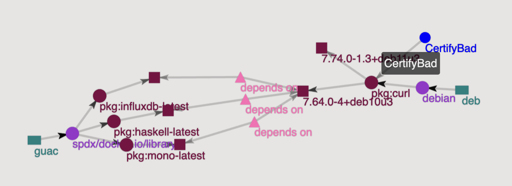

# Extending Left
## Bringing the Sec to DevSecOps Without the Pain


---

# About Mike
 
- Co-founder and CTO Kusari a Software Supply Chain Security Company
- Co-author of Securing the Software Supply Chain from Manning
- OpenSSF Technical Advisory Council member and SLSA Steering Committee
- CNCF Technical Advisory Group Security Lead
- Co-creator and maintainer of GUAC an OpenSSF Incubating Project

---

# Conway's Law
"Any organization that designs a system (defined broadly) will produce a design whose structure is a copy of the organization's communication structure" - Melvin Conway

---


<footer>Image credit: https://bonkersworld.net/organizational-charts

---

# A Quick Look into DevOps

- Eliminating silos
- Increased automation
- Shared responsibility
- Increased communication

---

# Communication is Faciliated Through the Data!

- Devs share code, tickets, etc.
- Ops shares metrics, alerts, etc.

---

# DevOps Outcomes
- Faster MTTR
- Higher performance
- Increased morale

---

# Why Not Security Too?
- Breaking down silos
- Increased automation
- Shared responsibility
- Increased communication

---

# Why Does it Seem More Difficult?
- Traditionally security has been a strict gating function
- ~2/3 of security teams don't share metrics, analytics, data
- Secrecy (some of it unwarranted)

---

# What's Changing?
- Increased velocity of regulations, e.g. EO on Cybersecurity
- Attacks are becoming more frequent
- Attacks are in some cases becoming more sophisticated

---

# Implementing

- Extend left, don't shift left
  - Communication needs to happen at every stage of the SDLC not just in front of a change approval board
- Use community and industry best practices, standards, frameworks, etc.
- Provide mechanisms for security teams to share data with development and operations and vice versa

---

# Software Supply Chain Security as an Example
- Securing the production and consumption of software
- Consumers want to ensure the software they use is safe
- Software producers are part of someone else's supply chain
- Difficult without apply DevSecOps
  - Manually validating all dependencies doesn't scale
---

# What the (Simplified) SDLC Looks Like


<footer>Image credit: https://slsa.dev

---

# Risks at every step

- Producer (Developer) can be compromised 
- Source repo can have malicious or vulnerable code pushed
- Build can run malicious builds, pull in vulnerable deps
- Package repos can have unverified packages in them
- Consumer can download from the wrong location
- And so much more...

---

# What DSO can look like in SSCS


---

# How does this help?

- Evidence lake holds on to all the important data
- Analytics provides insights and helps with identification of issues
- Automation helps with remediation
- Policy helps with enforcement
- Governance helps with audit and regulations, i.e. keeping the CISO out of jail 

---

# How do we enable this?

# <div align="center">FOLLOW COMMUNITY AND INDUSTRY STANDARDS FOR THE DATA

---

# What does that look like?

| NO      | YES |
| ----------- | ----------- |
| Proprietary SCA Reports | SBOMs |
| Unstructured build logs   | SLSA Attestations       |
| Exceptions via email | VEX |

- SBOM - Software Bill of Materials
- SLSA - Supply-chain Levels for Software Artifacts
- VEX - Vulnerability Exploitability Exchange

---

# Feedback Loop
- Get the data in the hands of the folks who need it when they need it!
  - Devs see it in their IDE and CLI tooling
  - SREs, and infrastructure engineers see it in their metrics, alerting, observability tools,  etc.
  - Security gets it in their dashboard when it's still being developed 

---

# GUAC

- Software supply chain knowledge graph
  - Integrates with SBOMs, SLSA, VEX, OSV, Deps.dev, Scorecard, etc.
- Integrates with tooling to get actionable insights into the hands of those who need it when they need it
- https://guac.sh 

---

# What's this look like for Dev?


---

# What's this look like for SRE/Infra?

```shell
---FRONTIER LEVEL 0---
3448900: pkg:deb/debian/curl@7.52.1-5+deb9u7?distro=debian-9&arch=amd64
...
5151532: pkg:deb/debian/curl

---FRONTIER LEVEL 1---
4849803: pkg:guac/spdx/docker.io/library/telegraf-latest
...
1827367: pkg:guac/spdx/docker.io/library/haxe-latest

---INFO NODES---
no info nodes found

---POINTS OF CONTACT---
no POCs found


---SUBGRAPH VISUALIZER URL---
http://localhost:3000/?path=288315...
```

---

# What's this look like for Security Engineering?



---

# Outcomes (in addition to DevOps)

- Devs can fix security issues as they happen
- Operations knows everywhere security issues are in the org
- Security understands the holistic risk and security posture

---

# Next Steps

- Platform Engineering
  - Build your organization's IT like a set of APIs and services.
- Further standardization in the space

---

# Thanks!

- GUAC has community meetings third Thursday of the month
  -  Check calendar at https://openssf.org
  -  https://guac.sh
- Hosted supply chain security platform and any of your other SDLC/Supply Chain Security needs: https://kusari.dev
- Lots of recorded talks that go into a deeper dive
  - Don't have a playlist yet
  - Search for Michael Lieberman, supply chain security, GUAC, SLSA, Secure Software Factory, etc.