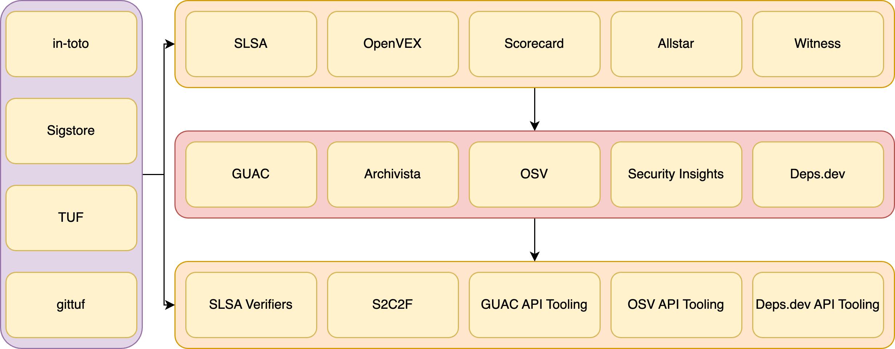

# Production, Consumption, and the Data
## The Open Source Security Sandwich

---

# About Mike
 
- Co-founder and CTO Kusari a Software Supply Chain Security Company
- Co-author of Securing the Software Supply Chain from Manning
- OpenSSF Technical Advisory Council and SLSA Steering Committee member
- CNCF Technical Advisory Group Security Lead
- Co-creator and maintainer of GUAC an OpenSSF Incubating Project 

---

# The Problem with Security

- Traditionally security has been a gating function
- Security is not seen as  an end user feature
- Security can be secretive (though it shouldn't be)
- Not as much open source security tooling

---

# Conway's Law (Always Relevant)

*Any organization that designs a system (defined broadly) will produce a design whose structure is a copy of the organization's communication structure.*
\- Melvin Conway

---

<footer>Image credit: https://bonkersworld.net/organizational-charts

---

<footer>
Image Credit: "<a target="_blank" rel="noopener noreferrer" href="https://www.flickr.com/photos/8901036@N07/4087289013">Fire in Dumpster</a>" by <a target="_blank" rel="noopener noreferrer" href="https://www.flickr.com/photos/8901036@N07">benwatts</a> is licensed under <a target="_blank" rel="noopener noreferrer" href="https://creativecommons.org/licenses/by/2.0/?ref=openverse">CC BY 2.0 </img></img></a>. 

---

# Organizational Structure of OSS

- Foundations
- Corporations
- Everyone else
  - Volunteers
  - Hobbyists

---

# Open Source Communication

- Open source maintainers don't owe anybody anything
- Not every project is maintained by a foundation or sponsored by a business
- Communication can be chaotic
  - Sometimes conflicting goals
- Communication is often asynchronous
  - World-wide
  - Volunteer's spare time
  - Not always a priority

---

# Open Source Security Communication

- Sometimes it can be the worst of both worlds
- Security stakeholders attempting to be gatekeeper
- Open source maintainers 

---

# State of the World Today*

- Proprietary data formats
- Lack of standardization
- Lack of security automation
- Lack of security templates

<footer>* Note: It's been changing

---

# Open data formats and practices!

- Open specifications backed by foundations and standards bodies over proprietary formats
- Open standard metadata stores and analytics platforms over proprietary walled gardens
- Open APIs over tightly coupled and locked down vendor applications
- Helps ensure we're all speaking the same language

---

| NO      | YES |
| ----------- | ----------- |
| Proprietary SCA Reports | SBOMs |
| Unstructured build logs and practices  | SLSA       |
| Exceptions via email | VEX |
| Proprietary health metrics | Scorecard |
| Custom security rule enforcement | Allstar |
| Arbitrary project layouts | Security Insights |
| Control spreadsheets for ingestion | S2C2F and OSCAL | 
| Tight coupling of SDLC systems | CD Events |
| Custom analytics and data stores | GUAC

---

# A Quick Tangential Rant

- Human readable documentation for a specification is good
- Machine readable specifications as the canonical definitions is needed as well
- JSON Schema, RDF, OWL, XSD, etc.
  - Codegen with type, constraint, and regex validation!
- Protobuf is good for on the wire, not great for validations outside of basic types (string, int32)

---

# High Level

---

# Next Steps

- Standard data formats means they can be used in API specifications!
  - OpenAPI/GraphQL/AsyncAPI
- Event driven is a MUST
  - We don't control what other OSS maintainers do
  - We need to rely on events and can't tightly couple
- Tie it all together in a toolbelt, a security toolbelt!
- Eventually a Software Supply Chain Control Plane

---

# What Does That Look Like?

---

# What about Today?

- Let's make it simple to get started
- Leave retrofitting for later
  - Show what we can do
- New projects should have security guardrails

---

# How do we implement this for Producers? (Example)

- Create Github repo
- Github action SLSA builder enabled
- Github action Scorecard enabled
- Github action GUAC enabled to
- Github action for SBOM
- Allstar application enabled on org if not already
- SECURITY-INSIGHTS.yml template with defaults

---

# How do we implement this for Consumers? (Example)

- Verify SLSA, Scorecard, etc. if they are being used
- Query GUAC, OSV, ETC
- Follow S2C2F practices, especially when the above aren't being followed
  - Build from source
  - Run scans

--- 

# How do we put it together and scale it? (Example)

- Store SLSA, SBOMs, Scorecard, etc. in GUAC
- Use GUAC, OSV, Deps.dev as data sources for policy and automation

---

# Takeaways!

- Use open standards for production and consumption of software
- Use open specifications for the data models
- Store data in open source data stores like GUAC, OSV, Deps.dev
- Communication in open source works when it's OPEN!  

---

# Here Come Skoot!

- Scute is a term for the bony plates on a turtle (along with other things)
- Scute is also a term for a shield
- Security is turtles all the way down
- Skoot is a tool to try and tie some of the other pieces together easier.
- This is an open source POC in Rust called Skootrs under https://github.com/kusaridev/skootrs

---

#  Where does Skoot go from here?

- If folks like it, let's make this more than just a POC!
- Add additional OpenSSF security tools
- Support multiple languages
- Support exporting linking output into datastores like OpenSSF Incubating Projects GUAC
- Support linking with verification tools
- Support outputting Skoot data in an open format.
- Support retrofitting existing repos
  
---

# Thanks!

- If you want to learn more about GUAC and see it in action come to my talk tomorrow!
- I have links to my book, GUAC, and stickers!