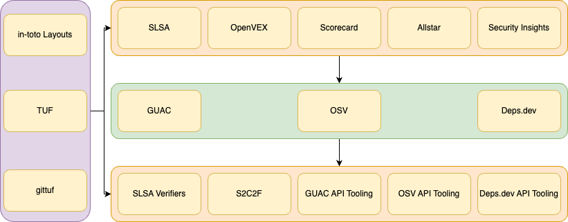
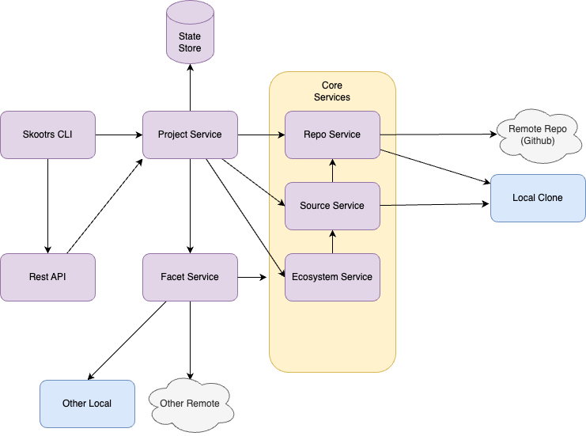

# Skootrs

## Build the shield for open source projects

https://github.com/mlieberman85/talks

---

- Co-founder and CTO Kusari a Software Supply Chain Security Company
- Co-author of Securing the Software Supply Chain from Manning
- OpenSSF Technical Advisory Council, Governing Board member and SLSA Steering Committee member
- CNCF Technical Advisory Group Security Lead
- Co-creator and maintainer of GUAC an OpenSSF Incubating Project

---

## A Little Background on Open Source Security

- Traditionally security has been a gating function
- Security is not seen as  an end user feature
- Security can be secretive (though it shouldn't be)
- Not as much open source security tooling

<footer>
<a target="_blank" rel="noopener noreferrer" href="../2023-12-04-ossfday/presentation.md">Content from my 2024 OpenSSF Day Japan Talk</a>

---

## Harder Than it Seems

- Developers are being asked to wear more and more hats
  - Backend
  - Frontend
  - Infrastructure/Cloud
  - Database
  - Security
- Open Source Developers don't owe anyone anything

---

## Open data formats and practices

- Open specifications backed by foundations and standards bodies over proprietary formats
- Open standard metadata stores and analytics platforms over proprietary walled gardens
- Open APIs over tightly coupled and locked down vendor applications
- Helps ensure we're all speaking the same language

---

| NO                                    | YES               |
| ------------------------------------- | ----------------- |
| Proprietary SCA Reports               | SBOMs             |
| Unstructured build logs and practices | SLSA              |
| Exceptions via email                  | VEX               |
| Proprietary health metrics            | Scorecard         |
| Custom security rule enforcement      | Allstar           |
| Arbitrary project layouts             | Security Insights |
| Control spreadsheets for ingestion    | S2C2F and OSCAL   |
| Tight coupling of SDLC systems        | CD Events         |
| Custom analytics and data stores      | GUAC              |

---

| NO                                    | YES               |
| ------------------------------------- | ----------------- |
| Runbooks and ticketing                | In-toto layouts             |
| Trusting arbitrary tools for updates  | TUF              |
| Utilizing proprietary repo ACLs     | Gittuf           |

---

## High Level Sandwich

---

## Sandwich Elements

- Producer metadata
- Metadata Storage
- Consumer tooling
- Rules and Policy

---

## What is needed to make this sandwich?

- A repo with various files
  - Github actions
  - in-toto layouts
- API calls to repo server
  - Branch protection
- 

---

## This is where Skootrs comes in

- Easy
- Straightforward
- Opinionated

---

## The Name

- Scute is the name for the plates on the back of reptiles like turtles
  - And it's turtles all the way down
- Scute is also the name of a Roman shield
- Skoot to disambiguate pronunciation
- Skootrs because it's written in Rust and "scooters" is just fun

---

## Goals

- Enable "easy button" creation of a secure-by-design/secure-by-default project
- Discover tool gaps in OpenSSF and other organizations' security recommendations
  - It should be easy to follow recommendations without constantly having to make changes

---

## Non-Goals

- Completely customizable set of configuration
- Retrofitting existing projects

<footer>Note: Only true for initial work

---

## Current Features

- Currently supports Go (and a small bit of Maven)
- Implements Scorecard (mostly)
  - Not the manual items

---

## Design

- Core Library
- CLI
- REST Server
- State store

---

## Core Library

- Models
- Services
- Templates
  - Parameterized Jinja-like templates for "facets"

---

## Models

- Just the data
- No logic
- Needs to be (de)serializable

---

## Services

- Project
- Repo
- Source
- Ecosystem
- Facet
  - This is akin to a configuration option for a project, repo, source, or other facet.
  - Calls the templates

---

## CLI

- Calls the services directly
- Runs it as a daemon
- Pulls metadata from state store

---

## REST Server

- OpenAPI
- Calls the services and should have feature parity with the CLI

---

## State Store

- Writes project metadata to a database

---

## Skootrs Architecture

---

## Facet Examples

- Source File Facets
  - README
  - LICENSE
  - Github Action YAML
- API Facets
  - Branch protection

---

## Roadmap (very early)

- Support Maven and Python
- Support Gitlab
- Support in-toto, TUF, and Gittuf
  - Just basic layouts
- Make telemetry better
- Make CLI able to call remote API directly
- Ability to update existing project
