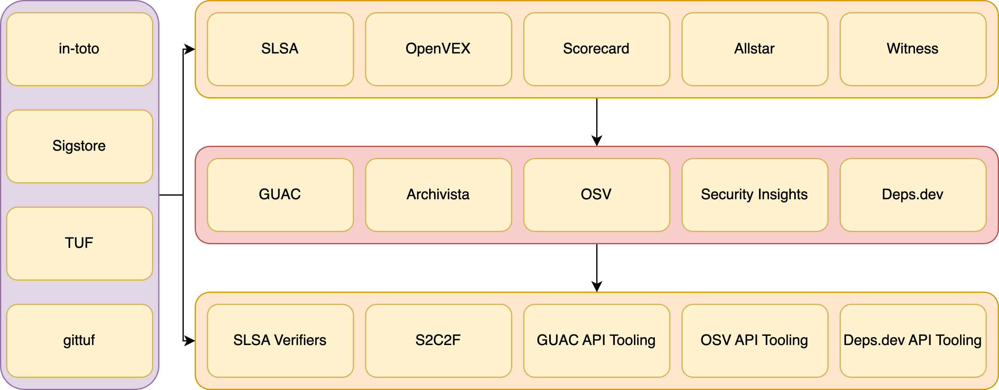

# Eating the Open Source Security Sandwich with Skootrs

## Michael Lieberman, Kusari

https://github.com/mlieberman85/talks

---

| NO                                    | YES               |
| ------------------------------------- | ----------------- |
| Proprietary SCA Reports               | SBOMs/SBOMit      |
| Unstructured build logs and practices | SLSA              |
| Exceptions via email                  | VEX               |
| Proprietary health metrics            | Scorecard         |
| Custom security rule enforcement      | Allstar           |
| Repo service specific permissions     | Gittuf            |
| Control spreadsheets for ingestion    | S2C2F and OSCAL   |
| Tight coupling of SDLC systems        | CD Events         |
| Custom analytics and data stores      | GUAC              |

---

---

## This is a lot of stuff

- Maintainers want to do the right things but they want it to be simple and they want to understand the value
- Tools don't always work well together
- Tools work better for certain ecosystems than others
- Maybe use Skootrs!
  - Follow along with: `cargo install skootrs-bin` and a `$GITHUB_TOKEN`

---

## What did we do?

- Generate highly opinionated configuration for security
- Output everything we did as events including CD events
- Stored the state of what we did
- Pulled security related project release outputs
- **Kubectl-like functionality for managing projects security.**

---

## Where do we go from here?

- Move towards an SDLC or supply chain control plane
- Follow modern approaches to applications to supply chain security
  - Zero Trust
  - Event Driven
  - Policy as code
    - https://youtu.be/Cr2Kwht3lqY - Parth Patel and Dejan Bosanac on GUAC + Policy
- **Bring in more end users and maintainers into the conversation!!!!!!**

---

## Join us!

- Go to skootrs.sh or github.com/kusaridev/skootrs
- https://discord.gg/ea74aBray2
- Please come contribute! **v0.1 out RIGHT NOW**
  - Not just code, help with docs, examples, use cases, etc.
- Plan to support more ecosystems, tools, in-toto attestations
  - Java/Maven, Rust/Cargo, Javascript/npm
