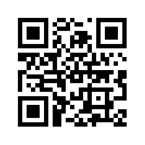

# Eating the Open Source Security Sandwich with Skootrs

## Michael Lieberman, Kusari

https://github.com/mlieberman85/talks

---

| NO                                    | YES               |
| ------------------------------------- | ----------------- |
| Proprietary SCA Reports               | SBOMs/SBOMit      |
| Unstructured build logs and practices | SLSA              |
| Exceptions via email                  | VEX               |
| Proprietary health metrics            | Scorecard         |
| Custom security rule enforcement      | Allstar           |
| Repo service specific permissions     | Gittuf            |
| Control spreadsheets for ingestion    | S2C2F and OSCAL   |
| Tight coupling of SDLC systems        | CD Events         |
| Custom analytics and data stores      | GUAC              |

---

---

## Next up for Skootrs

- Go to skootrs.sh or github.com/kusaridev/skootrs
- https://discord.gg/ea74aBray2
- Please come contribute!
  - Not just code, help with docs, examples, etc.
- Support for more ecosystems (Java/Maven, Rust/Cargo, JS/npm)
- Continue to work with the open source security community
